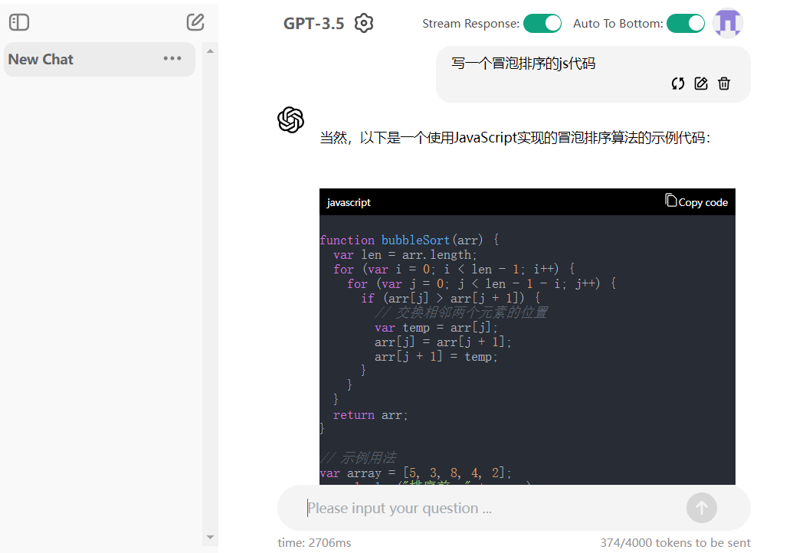

# Chat_GUI

# 🎉 Description

一个基于 Vue 3 和 Python FastAPI 的 GPT API 对话项目，用于构建前后端分离的应用。

FastAPI 后端与 GPT API 进行通信进行对话，并将结果传回 Vue 3 前端进行可视化和用户交互。

目前，仅支持的 GPT 的 API 类型：

| 类型         | 描述 |
| ------------ | ---- |
| OpenAI Key   | ⭕   |
| Azure AI Key | ⭕   |
| Gemini       | ❌   |
| 文心一言     | ❌   |

# ✨ Features

- **多用户支持**：支持多个用户同时进行操作
- **流式对话**：实现流式更新对话, 利用 FastAPI 的 WebSocket 和 vue3 的 v-for 渲染 实现实时数据更新
- **对话参数配置**：允许用户配置对话参数
- **Markdown 格式化**：支持代码片段和文本的 Markdown 格式化

# 📝 TODO

- [ ] WEB 端: 去掉 vue3 的 v-for 更新对话, 🤢 不合理的设计
- [ ] WEB 端: 重命名对话
- [ ] SERVER 端: 用户管理和 websocket 重连
- [ ] SERVER 端: 暂停对话的功能

Welcome to contribute to and improve this project! If you encounter any issues or have suggestions for enhancements, please raise an issue or submit a pull request.
